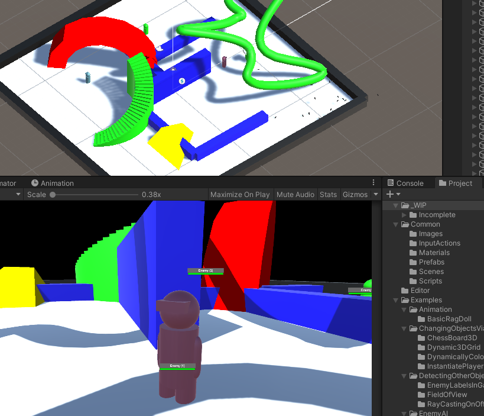

# Enemy AI
In this section there are a range of examples that can be used for enemy AI in Unity. A number of these build on from prior activities.

For example the following examples build from one another:
1. DetectAndMoveToEnemy
1. ShootEnemyInRange
1. ShootEnemyInFront
1. LineOfSiteBlocked

 
